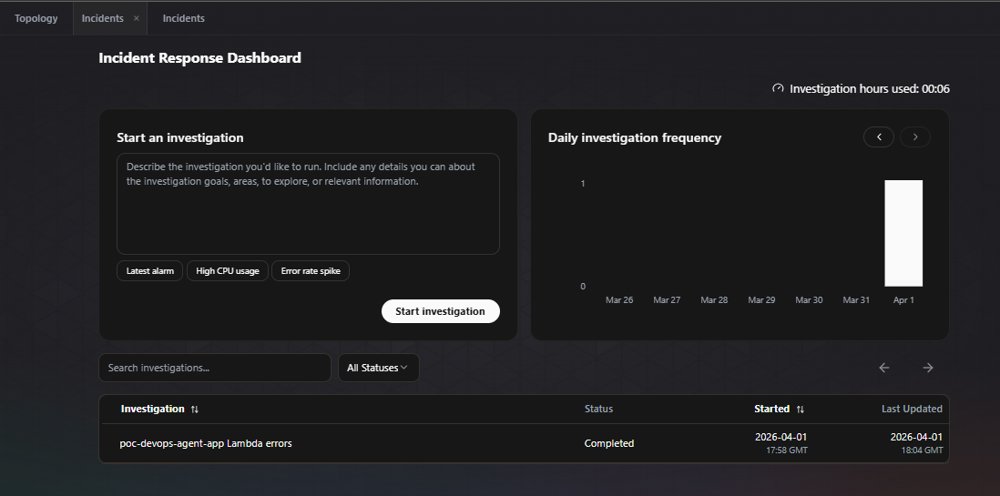
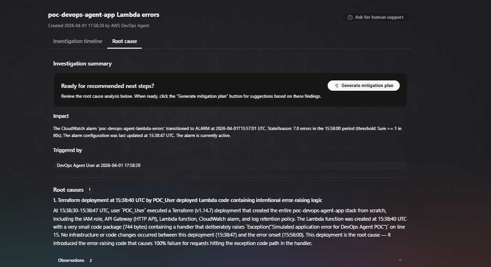

# AWS DevOps Agent — POC

A hands-on proof of concept for [AWS DevOps Agent](https://aws.amazon.com/devops-agent/), a frontier AI agent that autonomously investigates incidents, performs root cause analysis, and proactively prevents future outages.

> AWS DevOps Agent went **Generally Available on March 31, 2026**.

---

## What This POC Demonstrates

- Deploy a real AWS stack via Terraform (Lambda + API Gateway + CloudWatch)
- Simulate a production incident by triggering Lambda errors
- Watch the DevOps Agent autonomously investigate, correlate deployment history, read the deployed code, and identify root cause — in under 2 minutes

---

## Architecture

```
GitHub Repo (code + deploy history)
        ↓
GitHub Actions → Terraform Deploy
        ↓
AWS Lambda (Python) ← API Gateway (HTTP API)
        ↓ errors
CloudWatch Alarm
        ↓ triggers
AWS DevOps Agent → Root Cause Analysis → Chat Interface
```

**Resources deployed:**
| Resource | Name |
|---|---|
| Lambda Function | `poc-devops-agent-app` |
| API Gateway | `poc-devops-agent-api` (HTTP API) |
| IAM Role | `poc-devops-agent-lambda-role` |
| CloudWatch Alarm | `poc-devops-agent-lambda-errors` |
| CloudWatch Log Group | `/aws/lambda/poc-devops-agent-app` |

---

## POC Results

### Incident Response Dashboard


*The agent detected the CloudWatch alarm, launched an investigation, and marked it Completed.*

### Investigation Summary — Root Cause Analysis


*The agent traced the exact Terraform deployment (15:38 UTC, Terraform v1.14.7), read the deployed Lambda code, pinpointed line 15 as the root cause, confirmed zero other changes between deploy and error onset, and declared 100% root cause.*

### Key Agent Findings
- Detected **7 errors** in the `15:56:00` period, alarm transitioned at `15:57:01 UTC`
- Identified deploying user: `POC_User` via CloudTrail
- Identified deploy tool: **Terraform v1.14.7**
- Lambda package size: **744 bytes**
- Found exact exception: `Exception("Simulated application error for DevOps Agent POC")` at **line 15**
- Time from alarm to completed RCA: **~6 minutes of agent time**

---

## Prerequisites

- AWS Account (free tier works — DevOps Agent has a 2-month free trial)
- AWS CLI configured (`aws configure`)
- Terraform >= 1.0
- GitHub account

---

## Setup & Deploy

### 1. Clone the repo
```bash
git clone https://github.com/prathamo28/POC_AWS_Devops.git
cd POC_AWS_Devops
```

### 2. Deploy infrastructure
```bash
cd terraform
terraform init
terraform apply
```
Copy the `api_url` from the output.

### 3. Create Agent Space
Go to [AWS DevOps Agent Console](https://us-east-1.console.aws.amazon.com/aidevops/home?region=us-east-1#/overview) → Create Agent Space

### 4. Connect GitHub
Agent Space → Features tab → Pipeline → Add Source → GitHub → Install App on this repo

### 5. Simulate an incident
```bash
# Hit 4-5 times to trigger the CloudWatch alarm
curl <api_url>/simulate-error
```

### 6. Watch the agent investigate
Go to Agent Space → Operator Access (chat) → type:
```
Why is poc-devops-agent-app Lambda throwing errors? Investigate.
```

### 7. Clean up
```bash
terraform destroy
```

---

## Endpoints

| Endpoint | Purpose |
|---|---|
| `GET /` | Lists all endpoints |
| `GET /health` | Health check |
| `GET /simulate-error` | Throws exception (incident simulation) |
| `GET /simulate-latency` | Injects 3-6s delay (latency simulation) |

---

## What More Can Be Explored

This POC only scratches the surface. AWS DevOps Agent also supports:

- **Proactive recommendations** — analyzes historical incidents to prevent future ones
- **Multi-cloud topology** — Azure and on-prem environments
- **Third-party observability** — Datadog, Dynatrace, New Relic, Splunk, Grafana
- **Alerting integrations** — Slack, PagerDuty, ServiceNow
- **Custom skills** — extend the agent with your own tools via MCP
- **Custom charts & reports** — shareable operational insights

---

## Project Structure

```
POC_AWS_Devops/
├── terraform/
│   ├── main.tf          # Lambda, API Gateway, CloudWatch, IAM
│   ├── variables.tf     # Region, project name
│   └── outputs.tf       # API URL, alarm name, function name
├── src/
│   └── lambda_function.py   # Python Lambda with error/latency injection
├── .github/
│   └── workflows/
│       └── deploy.yml   # GitHub Actions → Terraform deploy on push to main
├── screenshots/
│   ├── incident-dashboard.png
│   └── investigation-summary.png
└── README.md
```

---

## Cost

**Free** for the first 2 months (new DevOps Agent customers):
- 10 agent spaces
- 20 hrs/month investigations
- 20 hrs/month on-demand SRE chat

After trial: $0.0083/agent-second (pay per use, no idle charges).
